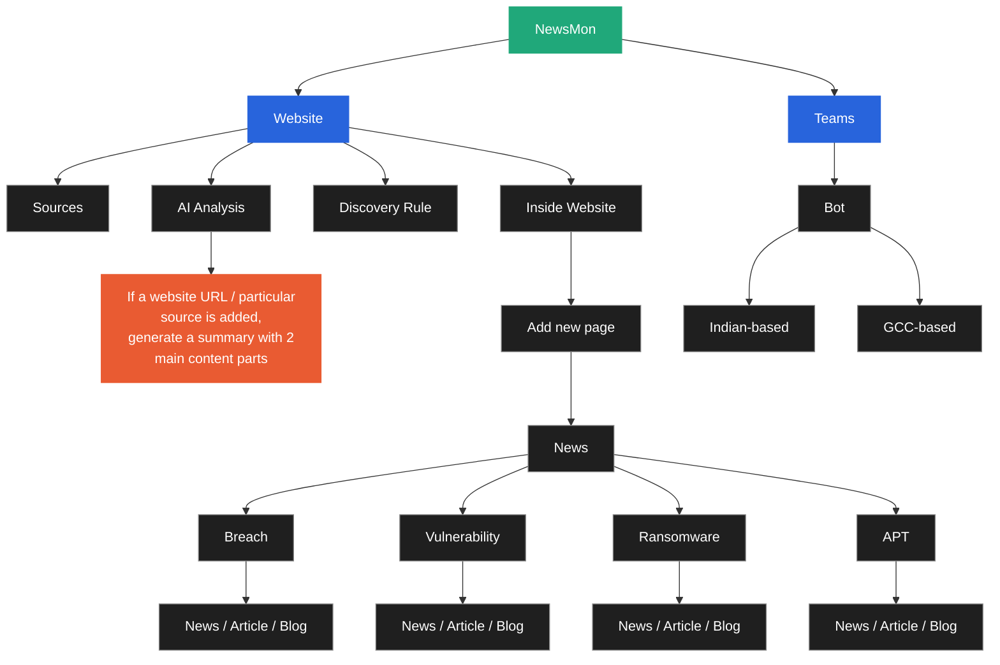
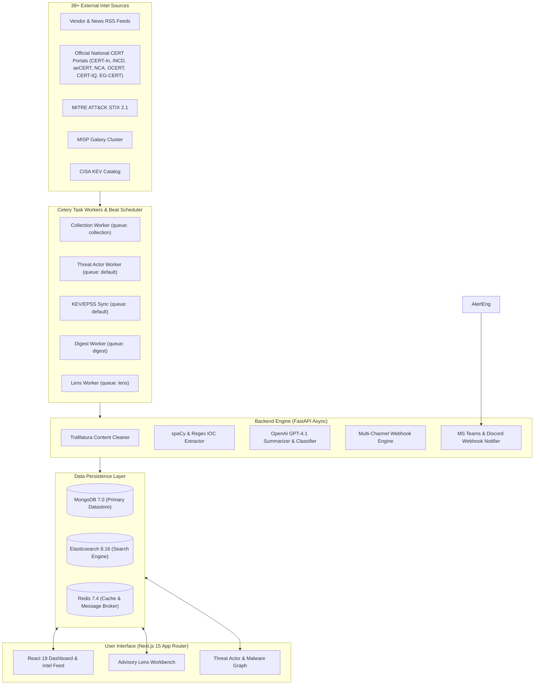
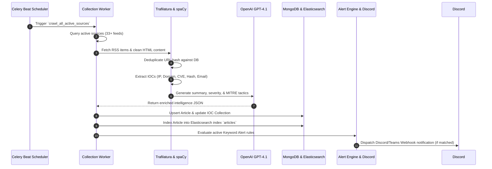
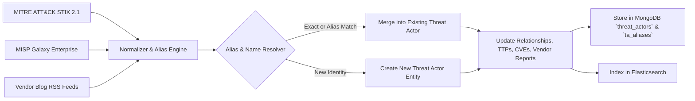
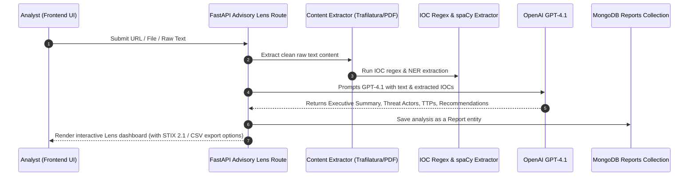
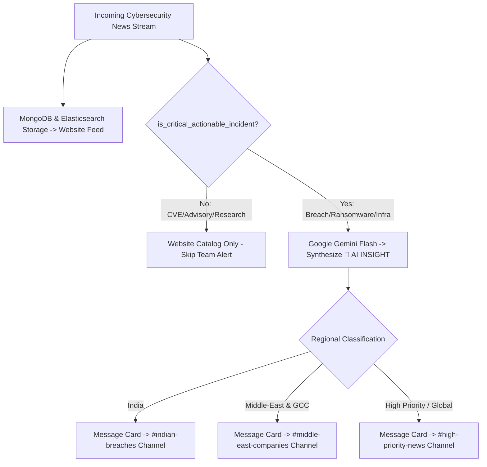
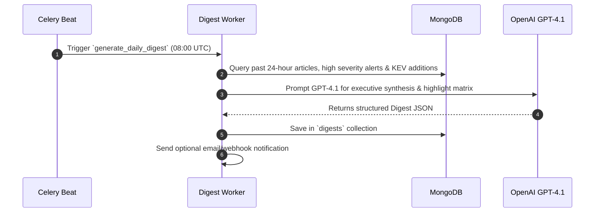

# ClarityTI — Comprehensive Technical Documentation & Architecture Manual

Welcome to the official technical documentation for **ClarityTI**, an enterprise-grade Cyber Threat Intelligence (CTI) platform built for SOC teams, Threat Analysts, Incident Responders, and Security Researchers.

---

## 📑 Table of Contents
1. [System Overview & Architecture](#1-system-overview--architecture)
2. [Workflows & Core Pipelines](#2-workflows--core-pipelines)
   - [Pipeline A: Ingestion & Enrichment Workflow](#pipeline-a-ingestion--enrichment-workflow)
   - [Pipeline B: Threat Actor Multi-Source Intelligence Engine](#pipeline-b-threat-actor-multi-source-intelligence-engine)
   - [Pipeline C: Advisory Lens Document & URL Analysis](#pipeline-c-advisory-lens-document--url-analysis)
   - [Pipeline D: Multi-Channel Webhook Notification Engine](#pipeline-d-multi-channel-webhook-notification-engine)
   - [Pipeline E: Automated 24-Hour AI Threat Digest](#pipeline-e-automated-24-hour-ai-threat-digest)
3. [Database Schemas & Data Dictionary](#3-database-schemas--data-dictionary)
   - [`sources` Collection](#1-sources-collection)
   - [`articles` Collection](#2-articles-collection)
   - [`threat_actors` Collection](#3-threat_actors-collection)
   - [`ta_aliases` Collection](#4-ta_aliases-collection)
   - [`ta_vendor_reports` Collection](#5-ta_vendor_reports-collection)
   - [`ta_relationships` Collection](#6-ta_relationships-collection)
   - [`ta_references` Collection](#7-ta_references-collection)
   - [`malware` Collection](#8-malware-collection)
   - [`campaigns` Collection](#9-campaigns-collection)
   - [`iocs` Collection](#10-iocs-collection)
   - [`cisa_kev` Collection](#11-cisa_kev-collection)
   - [`digests` Collection](#12-digests-collection)
   - [`reports` Collection](#13-reports-collection)
   - [`users` Collection](#14-users-collection)
   - [`logs` Collection](#15-logs-collection)
4. [API Routes Reference](#4-api-routes-reference)
5. [Celery Background Tasks & Schedule](#5-celery-background-tasks--schedule)
6. [Deployment & Operations Guide](#6-deployment--operations-guide)

---

## 1. System Overview & Architecture

ClarityTI (NewsMon) automates the end-to-end lifecycle of cyber threat intelligence: collection, extraction, normalization, enrichment, correlation, storage, search, and notification.



---



### Technology Stack
- **Backend API**: Python 3.12, FastAPI, Uvicorn, Pydantic v2.
- **Asynchronous Workers**: Celery, Redis Broker, Flower Monitor.
- **NLP & AI Engine**: Trafilatura, spaCy (`en_core_web_sm`), OpenAI GPT-4.1.
- **Primary Database**: MongoDB 7.0 with Motor (Async Driver).
- **Search Engine**: Elasticsearch 8.16 with full-text indexing.
- **Caching & Broker**: Redis 7.4.
- **Frontend App**: Next.js 15, React 19, TypeScript, TailwindCSS, Zustand, ECharts, Framer Motion.

---

## 2. Workflows & Core Pipelines

### Pipeline A: Ingestion & Enrichment Workflow

This pipeline runs continuously every 30 minutes to fetch new intelligence items.



---

### Pipeline B: Threat Actor Multi-Source Intelligence Engine

Combines MITRE ATT&CK, MISP Galaxy, vendor reports, and RSS articles into a unified threat actor knowledge graph.



---

### Pipeline C: Advisory Lens Document & URL Analysis

Advisory Lens enables analysts to input URLs, text snippets, or upload documents (PDF, MD, TXT, HTML) for real-time AI-powered threat analysis.



---

### Pipeline D: Critical Actionable Incident Engine & Multi-Channel Alert Routing

Provides high-precision triage separating broad website intelligence from emergency Team Alerts:

- **Website Feed:** Ingests all cybersecurity intelligence (CVEs, security advisories, patch releases, zero-day research, tool releases).
- **Team Alerts:** Strictly triggers on **Critical Actionable Incidents** (confirmed/claimed enterprise breaches, customer/employee data theft, ransomware attacks, company compromises, critical infrastructure attacks, and major service disruptions).



#### 🛡️ Critical Alert Conditions Checklist
Team Alerts trigger only when one or more of the following conditions are met:
1. **Corporate Breach:** Company/organization confirmed or alleged breached.
2. **Data Theft & Exfiltration:** Customer, employee, patient, or financial records stolen.
3. **Ransomware Deployment:** Ransomware deployed, systems/files encrypted, or extortion demands issued.
4. **Company Compromise:** Unauthorized administrative access or corporate network compromise.
5. **Critical Infrastructure Attack:** Power grid, energy utility, water, healthcare, or telecom attacked.
6. **Major Service Disruption:** Essential operations or online platforms disrupted by a cyberattack.
7. **Extortion Leaks:** Threat actors claim or publish stolen corporate databases on leak sites.

#### 📋 Microsoft Teams Critical Alert Card Structure (Powered by Google Gemini)
1. **Header Banner:** `📰 CYBER NEWS [DATE]`
2. **Title:** Incident headline (e.g. `Healthcare Giant McKesson Targeted in 284M Record Extortion Leak`)
3. **Summary:** Clean 2–3 sentence factual summary.
4. **Incident Metadata:** Category (🛡), Source ([Source Name](url)), Published Date, and Region (🌍).
5. **🔎 AI INSIGHT:** Executive risk synthesis and immediate mitigation instruction generated by Google Gemini.
6. **Action Button:** Direct clickable link (`READ FULL NEWS →` / `VIEW FULL REPORT →`).

---

### Pipeline E: Automated 24-Hour AI Threat Digest

Generates an executive-level threat intelligence daily briefing at 08:00 UTC.



---

## 3. Database Schemas & Data Dictionary

All data is stored in **MongoDB** (`clarityti` database). Below is the complete field specification.

### 1. `sources` Collection
Stores RSS and web crawling target configurations.

| Field | Type | Required | Default | Description | Index |
| :--- | :--- | :--- | :--- | :--- | :--- |
| `_id` | `ObjectId` | Yes | Auto | Unique identifier | Primary |
| `name` | `string` | Yes | - | Name of intelligence source | - |
| `slug` | `string` | Yes | - | Unique URL slug | **Unique Index** |
| `category` | `string` | Yes | - | Category (`vendor`, `news`, `cert`) | Index |
| `subcategory` | `string` | No | `null` | Sub-category (e.g. `cloud`, `endpoint`) | - |
| `base_url` | `string` | Yes | - | Main website URL | - |
| `rss_url` | `string` | No | `null` | Feed RSS URL | - |
| `logo_url` | `string` | No | `null` | Source favicon/logo URL | - |
| `collection_method` | `string` | Yes | `"rss"` | Method (`rss`, `scraper`, `api`) | - |
| `schedule_cron` | `string` | Yes | `"*/30 * * * *"` | Cron execution pattern | - |
| `rate_limit_rpm` | `integer` | Yes | `10` | Rate limit requests per minute | - |
| `priority` | `integer` | Yes | `2` | Priority weight (1-5) | Index |
| `is_active` | `boolean` | Yes | `true` | Active status flag | Index |
| `article_count` | `integer` | Yes | `0` | Total articles collected | - |
| `health_status` | `string` | Yes | `"healthy"` | Health status (`healthy`, `degraded`, `failing`) | Index |
| `last_crawled_at` | `datetime` | No | `null` | Last crawl timestamp | Index |
| `created_at` | `datetime` | Yes | UTC Now | Creation timestamp | - |

---

### 2. `articles` Collection
Stores ingested intelligence articles, advisories, and news items.

| Field | Type | Required | Default | Description | Index |
| :--- | :--- | :--- | :--- | :--- | :--- |
| `_id` | `ObjectId` | Yes | Auto | Primary key | Primary |
| `source_id` | `string` | Yes | - | ID of source | Index |
| `source_name` | `string` | Yes | - | Source name | - |
| `source_category` | `string` | Yes | - | Category (`vendor`, `news`, `cert`) | Index |
| `source_slug` | `string` | Yes | - | Source slug | - |
| `url` | `string` | Yes | - | Original article URL | - |
| `url_hash` | `string` | Yes | - | MD5 hash of normalized URL | **Unique Index** |
| `title` | `string` | Yes | - | Article title | **Text Index** |
| `summary` | `string` | No | `null` | Article summary | **Text Index** |
| `content_raw` | `string` | No | `null` | Uncleaned HTML content | - |
| `content_clean` | `string` | No | `null` | Extracted plaintext | - |
| `content_markdown` | `string` | No | `null` | Extracted Markdown | - |
| `author` | `string` | No | `null` | Author name | - |
| `published_at` | `datetime` | No | `null` | Publication timestamp | Index |
| `crawled_at` | `datetime` | Yes | UTC Now | Ingestion timestamp | Index |
| `severity` | `string` | Yes | `"informational"` | Severity (`critical`, `high`, `medium`, `low`, `informational`) | Index |
| `severity_score` | `float` | Yes | `0.0` | Severity numerical score (0-10) | - |
| `tags` | `array[string]` | Yes | `[]` | Categorization tags | Index |
| `threat_actors` | `array[string]` | Yes | `[]` | Extracted threat actor names | Index |
| `malware_families` | `array[string]` | Yes | `[]` | Extracted malware names | Index |
| `cves` | `array[string]` | Yes | `[]` | Extracted CVE IDs | Index |
| `mitre_techniques` | `array[object]` | Yes | `[]` | MITRE technique objects | - |
| `iocs` | `object` | Yes | `{}` | Extracted IOC dictionary | - |
| `ioc_count` | `integer` | Yes | `0` | Total IOC count | - |
| `enrichment_status` | `string` | Yes | `"pending"` | Status (`pending`, `completed`, `failed`) | Index |
| `ai_summary` | `string` | No | `null` | GPT-4.1 generated executive summary | **Text Index** |
| `is_duplicate` | `boolean` | Yes | `false` | Duplicate article flag | Index |

---

### 3. `threat_actors` Collection
Canonical threat actor master profiles.

| Field | Type | Required | Default | Description | Index |
| :--- | :--- | :--- | :--- | :--- | :--- |
| `_id` | `ObjectId` | Yes | Auto | Unique ID | Primary |
| `name` | `string` | Yes | - | Canonical actor name | **Unique Index / Text** |
| `slug` | `string` | No | `null` | URL-friendly slug | **Unique Index** |
| `aliases` | `array[string]` | Yes | `[]` | Known alternative names | **Index / Text** |
| `type` | `string` | Yes | `"unknown"` | Type (`apt`, `ransomware-group`, `hacktivist`, `criminal`) | Index |
| `origin_country` | `string` | No | `null` | Country of origin (ISO code / country name) | Index |
| `motivation` | `array[string]` | Yes | `[]` | Financial, Espionage, Sabotage | - |
| `active_status` | `string` | Yes | `"active"` | `active`, `inactive`, `disrupted` | Index |
| `mitre_group_id` | `string` | No | `null` | MITRE ATT&CK Group ID (e.g. `G0007`) | Index |
| `targeted_sectors` | `array[string]` | Yes | `[]` | Targeted industry sectors | Index |
| `targeted_countries` | `array[string]` | Yes | `[]` | Targeted countries | - |
| `confidence_score` | `float` | Yes | `0.5` | Data confidence score (0-1) | Index |
| `article_count` | `integer` | Yes | `0` | Total linked intelligence articles | Index |
| `report_count` | `integer` | Yes | `0` | Total linked vendor reports | - |

---

### 4. `ta_aliases` Collection
Normalised alias lookup table for fast threat actor identity resolution.

| Field | Type | Required | Default | Description | Index |
| :--- | :--- | :--- | :--- | :--- | :--- |
| `_id` | `ObjectId` | Yes | Auto | Primary key | Primary |
| `alias_lower` | `string` | Yes | - | Lowercase alias name | **Unique Index** |
| `canonical_name` | `string` | Yes | - | Canonical Threat Actor Name | Index |
| `actor_id` | `string` | Yes | - | MongoDB ObjectId string of Threat Actor | Index |
| `source` | `string` | Yes | `"mitre"` | Origin of alias (`mitre`, `misp`, `vendor`) | - |
| `confidence` | `float` | Yes | `1.0` | Alias confidence score | - |

---

### 5. `ta_vendor_reports` Collection
Tracks vendor blog posts and intelligence reports referencing threat actors.

| Field | Type | Required | Default | Description | Index |
| :--- | :--- | :--- | :--- | :--- | :--- |
| `_id` | `ObjectId` | Yes | Auto | Primary key | Primary |
| `url` | `string` | Yes | - | Vendor report URL | **Unique Index** |
| `title` | `string` | Yes | - | Report title | - |
| `source` | `string` | Yes | - | Security vendor name | Index |
| `published_at` | `datetime` | No | `null` | Report publication timestamp | Index |
| `summary` | `string` | No | `null` | Executive summary of vendor report | - |
| `actor_ids` | `array[string]` | Yes | `[]` | Resolved Threat Actor IDs | Index |
| `cves` | `array[string]` | Yes | `[]` | CVEs mentioned in report | - |
| `iocs` | `object` | Yes | `{}` | Extracted IOC dictionary | - |

---

### 6. `ta_relationships` Collection
Directional relationship store between CTI entities (Actor $\rightarrow$ Malware, Actor $\rightarrow$ Campaign).

| Field | Type | Required | Default | Description | Index |
| :--- | :--- | :--- | :--- | :--- | :--- |
| `_id` | `ObjectId` | Yes | Auto | Primary key | Primary |
| `source_id` | `string` | Yes | - | Entity source ID | **Compound Unique Index** (`source_id`, `target_id`, `relationship`) |
| `source_type` | `string` | Yes | - | `threat_actor`, `malware`, `campaign` | - |
| `target_id` | `string` | Yes | - | Entity target ID | Index |
| `target_type` | `string` | Yes | - | `threat_actor`, `malware`, `campaign` | - |
| `relationship` | `string` | Yes | - | `uses`, `attributed_to`, `part_of`, `targets` | - |
| `confidence` | `float` | Yes | `0.8` | Relationship confidence score | - |

---

### 7. `ta_references` Collection
Canonical URL reference repository for threat actor profiles.

| Field | Type | Required | Default | Description | Index |
| :--- | :--- | :--- | :--- | :--- | :--- |
| `_id` | `ObjectId` | Yes | Auto | Primary key | Primary |
| `url` | `string` | Yes | - | External reference URL | **Unique Index** |
| `actor_id` | `string` | Yes | - | Associated Threat Actor ID | Index |

---

### 8. `malware` Collection
Malware family registry.

| Field | Type | Required | Default | Description | Index |
| :--- | :--- | :--- | :--- | :--- | :--- |
| `_id` | `ObjectId` | Yes | Auto | Primary key | Primary |
| `name` | `string` | Yes | - | Malware family name | **Unique Index** |
| `family` | `string` | No | `null` | Parent malware family | Index |
| `type` | `string` | Yes | `"unknown"` | Type (`ransomware`, `trojan`, `backdoor`, `stealer`, `rat`) | Index |
| `active_status` | `string` | Yes | `"active"` | `active`, `inactive` | Index |
| `platforms` | `array[string]` | Yes | `["Windows"]` | Target operating systems | - |
| `threat_actors` | `array[string]` | Yes | `[]` | Associated threat actor IDs/names | Index |
| `yara_rules` | `array[string]` | Yes | `[]` | YARA rule strings | - |

---

### 9. `campaigns` Collection
Attack campaign timelines and tracking.

| Field | Type | Required | Default | Description | Index |
| :--- | :--- | :--- | :--- | :--- | :--- |
| `_id` | `ObjectId` | Yes | Auto | Primary key | Primary |
| `name` | `string` | Yes | - | Campaign title | **Unique Index** |
| `threat_actors` | `array[string]` | Yes | `[]` | Associated threat actors | Index |
| `targeted_sectors` | `array[string]` | Yes | `[]` | Targeted industries | Index |
| `start_date` | `datetime` | No | `null` | Start date of campaign | Index |
| `active_status` | `string` | Yes | `"active"` | Campaign status | Index |

---

### 10. `iocs` Collection
Master Indicators of Compromise (IOC) database.

| Field | Type | Required | Default | Description | Index |
| :--- | :--- | :--- | :--- | :--- | :--- |
| `_id` | `ObjectId` | Yes | Auto | Primary key | Primary |
| `type` | `string` | Yes | - | `ipv4`, `domain`, `sha256`, `cve`, `url`, `email` | **Compound Unique Index** (`type`, `value`) |
| `value` | `string` | Yes | - | Normalized IOC value | Index |
| `confidence` | `float` | Yes | `0.9` | Confidence level | - |
| `first_seen` | `datetime` | Yes | UTC Now | First seen timestamp | Index |
| `last_seen` | `datetime` | Yes | UTC Now | Last seen timestamp | - |
| `is_active` | `boolean` | Yes | `true` | Active status flag | Index |
| `threat_actors` | `array[string]` | Yes | `[]` | Linked threat actors | Index |

---

### 11. `cisa_kev` Collection
CISA Known Exploited Vulnerabilities catalog with EPSS data.

| Field | Type | Required | Default | Description | Index |
| :--- | :--- | :--- | :--- | :--- | :--- |
| `_id` | `ObjectId` | Yes | Auto | Primary key | Primary |
| `cve_id` | `string` | Yes | - | CVE Identifier (e.g., `CVE-2024-21887`) | **Unique Index** |
| `vendor` | `string` | Yes | - | Affected Vendor | Index |
| `product` | `string` | Yes | - | Affected Product | - |
| `vulnerability_name` | `string` | Yes | - | Short vulnerability title | - |
| `date_added` | `datetime` | No | `null` | Date added to CISA KEV | Index |
| `due_date` | `datetime` | No | `null` | Federal remediation due date | Index |
| `known_ransomware` | `boolean` | Yes | `false` | Known use in ransomware campaigns | Index |
| `cvss_v3_score` | `float` | No | `null` | CVSS v3.1 score | Index |
| `epss_score` | `float` | No | `null` | FIRST EPSS exploitation probability score | Index |

---

### 12. `digests` Collection
Automated 24-hour executive AI threat intelligence briefings.

| Field | Type | Required | Default | Description | Index |
| :--- | :--- | :--- | :--- | :--- | :--- |
| `_id` | `ObjectId` | Yes | Auto | Primary key | Primary |
| `period_start` | `datetime` | Yes | - | Start time of analysis window | - |
| `period_end` | `datetime` | Yes | - | End time of analysis window | - |
| `generated_at` | `datetime` | Yes | UTC Now | Generation timestamp | - |
| `ai_model` | `string` | Yes | `"gpt-4.1"` | OpenAI model used | - |
| `digest` | `object` | Yes | `{}` | Structured JSON digest content | - |

---

### 13. `reports` Collection
Saved intelligence reports created manually or via Advisory Lens.

| Field | Type | Required | Default | Description | Index |
| :--- | :--- | :--- | :--- | :--- | :--- |
| `_id` | `ObjectId` | Yes | Auto | Primary key | Primary |
| `job_id` | `string` | Yes | - | Advisory Lens job ID | **Unique Index** |
| `created_by` | `string` | Yes | - | User ID / system identifier | Index |
| `status` | `string` | Yes | - | `pending`, `processing`, `completed`, `failed` | Index |
| `share_token` | `string` | No | `null` | Unique share token for public sharing | **Sparse Index** |

---

### 14. `users` Collection
User accounts & RBAC management.

| Field | Type | Required | Default | Description | Index |
| :--- | :--- | :--- | :--- | :--- | :--- |
| `_id` | `ObjectId` | Yes | Auto | Primary key | Primary |
| `email` | `string` | Yes | - | User email address | **Unique Index** |
| `role` | `string` | Yes | `"analyst"` | Role (`admin`, `analyst`, `viewer`) | Index |
| `api_key` | `string` | No | `null` | Personal API Key | **Sparse Index** |

---

### 15. `logs` Collection
Audit logging and operational system metrics.

| Field | Type | Required | Default | Description | Index |
| :--- | :--- | :--- | :--- | :--- | :--- |
| `_id` | `ObjectId` | Yes | Auto | Primary key | Primary |
| `created_at` | `datetime` | Yes | UTC Now | Log timestamp | **TTL Index (90 days)** |
| `category` | `string` | Yes | - | Log category (`ingestion`, `auth`, `system`) | Index |
| `level` | `string` | Yes | - | `INFO`, `WARNING`, `ERROR` | Index |

---

## 4. API Routes Reference

All endpoints are hosted under the `/api/v1` base route.

| Method | Endpoint Path | Description | Access Tag |
| :--- | :--- | :--- | :--- |
| `POST` | `/api/v1/auth/login` | Authenticate user & receive JWT token | Authentication |
| `GET` | `/api/v1/feed` | Query intelligence feed with pagination & filters | Intelligence Feed |
| `GET` | `/api/v1/feed/{id}` | Retrieve single article details by ObjectId | Intelligence Feed |
| `GET` | `/api/v1/cyberpulse` | Query real-time cyber breach heat map data | CyberPulse Heat Map |
| `GET` | `/api/v1/viral-events` | Fetch viral and high-impact security outbreak events | CyberPulse Viral Events |
| `POST` | `/api/v1/lens/analyze` | Submit URL, text, or file for Advisory Lens analysis | Advisory Lens |
| `GET` | `/api/v1/lens/jobs/{job_id}` | Check status and result of Advisory Lens job | Advisory Lens |
| `GET` | `/api/v1/reports` | List saved intelligence reports | Reports |
| `GET` | `/api/v1/reports/{id}/export/stix` | Export report as STIX 2.1 JSON Bundle | Reports |
| `GET` | `/api/v1/reports/{id}/export/csv` | Export report IOCs as CSV file | Reports |
| `GET` | `/api/v1/kev` | Query CISA KEV catalog with EPSS filters | CISA KEV |
| `GET` | `/api/v1/digest/latest` | Fetch latest 24-hour executive AI digest | AI Digest |
| `POST` | `/api/v1/search` | Full-text Elasticsearch + MongoDB hybrid search | Search |
| `GET` | `/api/v1/threat-actors` | List threat actors with country & industry filters | Threat Actors |
| `GET` | `/api/v1/threat-actors/{id}` | Get complete threat actor profile with graph data | Threat Actors |
| `GET` | `/api/v1/malware` | List malware families | Malware |
| `GET` | `/api/v1/campaigns` | List attack campaigns and timelines | Campaigns |
| `GET` | `/api/v1/clusters` | Query news clusters and discovery rules | Country & Sector Clusters |
| `POST` | `/api/v1/clusters` | Create custom cluster discovery rule | Country & Sector Clusters |
| `GET` | `/api/v1/teams/config` | Get Microsoft Teams webhook configuration | MS Teams Integration |
| `POST` | `/api/v1/teams/webhook` | Save & test Microsoft Teams channel webhooks (`indian_based`, `gcc_middle_east`) | MS Teams Integration |
| `POST` | `/api/v1/teams/send-todays-news` | Dispatch today's news feed to Teams regional channels | MS Teams Integration |
| `GET` | `/api/v1/sources` | List all 72+ intelligence sources & official CERT health status | Sources |
| `POST` | `/api/v1/sources/add-url` | Add website URL for scraping & 2-Part AI summary generation | Sources |
| `GET` | `/api/v1/analytics/overview` | Platform metrics & MITRE ATT&CK breakdown | Analytics |
| `GET` | `/api/v1/ws` | Real-time WebSocket connection for live threat alerts | WebSocket |

---

## 5. Celery Background Tasks & Schedule

| Task Name | Queue | Schedule / Trigger | Purpose |
| :--- | :--- | :--- | :--- |
| `workers.tasks.collection_tasks.crawl_all_active_sources` | `collection` | Every 30 mins (`*/30 * * * *`) | Crawl all 39+ active RSS & official CERT feeds |
| `workers.tasks.threat_actor_tasks.sync_mitre_attack` | `default` | Daily 02:00 UTC | Ingest latest STIX 2.1 MITRE ATT&CK enterprise group data |
| `workers.tasks.threat_actor_tasks.sync_misp_galaxy` | `default` | Daily 02:30 UTC | Ingest MISP Galaxy threat actor cluster JSON |
| `workers.tasks.threat_actor_tasks.sync_vendor_rss` | `default` | Every 6 hours | Ingest vendor reports & correlate with Threat Actors |
| `workers.tasks.threat_actor_tasks.enrich_all_actors` | `default` | Daily 04:00 UTC | Execute identity deduplication & link graph builder |
| `workers.tasks.kev_tasks.sync_kev_catalog` | `default` | Daily 06:00 UTC | Sync CISA Known Exploited Vulnerabilities catalog |
| `workers.tasks.kev_tasks.enrich_epss_scores` | `default` | Daily 07:00 UTC | Download FIRST EPSS exploitation probability dataset |
| `workers.tasks.digest_tasks.generate_daily_digest` | `digest` | Daily 08:00 UTC | Synthesize past 24-hour threat intelligence with GPT-4.1 |

---

## 6. Deployment & Operations Guide

### Docker Compose Production Start
To launch the entire platform (Databases, API, Celery Workers, Flower, Next.js UI) in detached mode:

```powershell
docker compose up -d --build
```

### Access Points
- **Web UI Platform**: [http://localhost:3000](http://localhost:3000)
- **FastAPI OpenAPI Interactive Docs**: [http://localhost:8000/docs](http://localhost:8000/docs)
- **Celery Flower Task Dashboard**: [http://localhost:5555](http://localhost:5555)

---

## 7. CTI Keyword Taxonomy & Operational Utility Scripts

### Keyword Taxonomy Structure (`files/Keywords/`)
The classification engine reads standardized keyword dictionaries across 6 core threat domains:
- **`Attacks/`**: `Cyber Espionage.txt`, `DDoS.txt`, `Phishing.txt`, `Ransomware.txt`, `Supply Chain.txt`
- **`Geography/`**: `India.txt`, `USA.txt`, `China.txt`, `Europe.txt`, `Middle East.txt`, `Russia.txt`
- **`Malware/`**: `Botnet.txt`, `Infostealer.txt`, `RAT.txt`, `Spyware.txt`, `Trojan.txt`
- **`Targets/`**: `Banking.txt`, `Critical Infrastructure.txt`, `Energy.txt`, `Government.txt`, `Healthcare.txt`, `Telecom.txt`
- **`Threat Actors/`**: `APT.txt`, `Cybercriminals.txt`, `Hacktivists.txt`, `Ransomware Groups.txt`
- **`Vulnerabilities/`**: `CVE.txt`, `Privilege Escalation.txt`, `RCE.txt`, `Zero-Day.txt`

### Operational Scripts (`backend/scripts/`)
| Script | Command | Purpose |
| :--- | :--- | :--- |
| `crawl_and_dispatch_teams.py` | `python backend/scripts/crawl_and_dispatch_teams.py` | Crawls active feeds and dispatches breach cards to Microsoft Teams |
| `link_threat_actors.py` | `python backend/scripts/link_threat_actors.py` | Correlates and links articles with canonical Threat Actor entities |
| `run_smart_deduplication.py` | `python backend/scripts/run_smart_deduplication.py` | Identifies and clusters near-duplicate threat stories via embedding similarity |
| `backfill_2018_present.py` | `python backend/scripts/backfill_2018_present.py` | Archives historical CTI data from 2018 to the present |
| `check_and_add_india_sources.py` | `python backend/scripts/check_and_add_india_sources.py` | Verifies and registers regional Indian cyber intelligence feeds |

---
*TLP: WHITE · ClarityTI / NewsMon Enterprise Cyber Threat Intelligence Platform v1.0.0*

